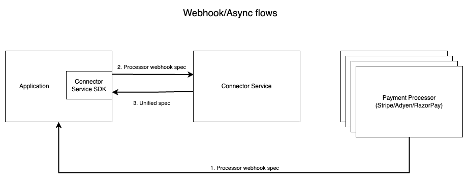

<p align="center">
  
  
  </p>

<h1 align="center">Open-Source Payments Connector Service</h1>

<div align="center">

Processor Agnostic Payments

</div>

<p align="center">
  
  
</p>

---

## Table of Contents

1.  [Introduction](#introduction)
2.  [Architecture Overview](#architecture-overview)
3.  [Component/Implementation Overview](#component-overview)
4.  [Supported Payment Processors and Methods](#supported-payment-processors-and-methods)
5.  [Getting Started](#getting-started)
6.  [Contribution](#contribution)
7.  [Related Projects](#related-projects)

---

<a name="introduction"></a>
## 🔌 Introduction

> The "Linux moment" for payments.

**Connector Service** is an open source, stateless merchant payments abstraction service (built using gRPC) that enables developers to integrate with a wide variety of payment processors using a unified contract. It offers the following capabilities.

- Unified contract across multiple payment processors
- Establishing and accepting connections to numerous remote endpoints of payment processors like Stripe/Adyen/Razorpay
- Supports all payment payment life-cycle management operations like including authorization, capture, refunds, status and chargebacks across processors
- Client-SDKs in multiple programming languages (Java, Python, Go, Rust, PHP) for rapid integration.

The objective is to liberate merchants and fintechs from being locked-in to the contract of a single payment processor and make switching payment processors a breeze.  Given its open source nature, we expect it to eventually encompass the widest variety of processor support across the globe through community contributions and support.

The Connector Service has been in production since Jan 2023 and is a part of Hyperswitch - Composable & Open Source Payment Orchestration platform, built by the team from Juspay.

Built for scalability and portability, it allows businesses to seamlessly switch processors without disrupting their internal business logic.  One can think of this as the payments equivalent of the [open telemetry](https://opentelemetry.io/) and [open feature](https://openfeature.dev/).

---

<a name="architecture-overview"></a>
## 🏗️ Architecture Overview

The connector service comprises of two major runtime components:

- a **gRPC service** that offers a unified interface for all merchant payment operations supported by different payment processors around the world.  This service would run as part of your application deployment.  Some of these operations include:
  - authorization
  - capture
  - refund
  - chargeback
  - dispute
  - webhook normalization
- a **client** (typically in the language of your choice) that integrates in your application to invoke the above gRPC service.

<p align="center">
  
</p>

<p align="center">
  
</p>

---

<a name="component-overview"></a>
## 🏗️ Component / Implementation Overview

The code for the project is organized in the following directory structure.  The details for the key directories is explained below:

```
connector-service/
├── backend/
│   ├── connector-integration/
│   ├── grpc-api-types/
│   │   └── proto/
│   ├── grpc-server/
│   ├── domain-types/
├── sdk/
│   ├── node-grpc-client/
│   ├── python-grpc-client/
│   ├── rust-grpc-client/
└── README.md
```

**grpc-server** - Implements the gRPC server. It receives requests via defined gRPC interfaces, performs flow-type conversions, interacts with connector-integration to generate the connector-specific CURL request, sends the request to the connector, and constructs the appropriate response

**connector-integration** - Contains payment processor specific transformations and logic for each flow. It is responsible for converting generic flow data into payment processor specific formats and generating the corresponding HTTP (CURL) requests

**grpc-api-types** - Auto-generated gRPC API types and interface definitions, generated from .proto files. These types are used for communication between services and clients. Also contains .proto files for each gRPC service, which define the data structures and service interfaces used for communication

**domain-types** - Common intermediate representation for the `grpc-server` and the `connector-integration` components to operate on.

**sdk** - Provides client SDKs for different languages to interact with the gRPC server, allowing users to integrate easily with their system

### Connector Integration Trait

The `connector-integration` component uses Rust's [trait mechanism](https://doc.rust-lang.org/book/ch10-02-traits.html) to allow each payment processor to define its implementation for a particular payment operation.  Each payment operation is expected to implement the following set of functions that enables the framework to create and invoke the appropriate API of the payment processor.

```rust
trait ConnectorIntegration<Flow, ResourceCommonData, Req, Resp> {
  fn get_headers();
  fn get_content_type();
  fn get_http_method();
  fn get_url();
  fn get_request_body();
  fn build_request();
  fn handle_response();
  fn get_error_response();
}
```

### Incoming Webhook Trait

On similar lines there is a trait to implement the processing of webhooks and convert it to the common representation.

```rust
trait IncomingWebhook {
   fn verify_webhook_source();
   fn get_event_type();
   fn process_payment_webhook();
   fn process_refund_webhook();
}
```
---
<a name="getting-started"></a>
## 🚀 Getting Started

### Prerequisites

Before setting up the project, ensure you have the following pre-requisites installed:

- [Rust and Cargo](https://www.rust-lang.org/tools/install)
- [grpcurl](https://github.com/fullstorydev/grpcurl)

---

#### Rust / Cargo Installation

##### MacOS

1. **Setup Rust/Cargo**
   ```shell
   curl --proto '=https' --tlsv1.2 -sSf https://sh.rustup.rs | sh
   ```

   When prompted, proceed with the `default` profile, which installs the stable
   toolchain.

   Optionally, verify that the Rust compiler and `cargo` are successfully
   installed:

   ```shell
   rustc --version
   ```

   _Be careful when running shell scripts downloaded from the Internet.
   We only suggest running this script as there seems to be no `rustup` package
   available in the Ubuntu package repository._

2. **Setup grpcurl**
   ```shell
   brew install grpcurl
   ```
   ```shell
    grpcurl --version
   ```

---
##### Windows

1. **Setup Rust/Cargo**

**Option 1:** Using the installer
Download the Rust installer from https://www.rust-lang.org/tools/install
Run the downloaded executable (rustup-init.exe)
Follow the on-screen instructions

**Option 2:** Using powershell
```bash
winget install -e --id Rustlang.Rust.GNU
```

2. **Setup grpcurl**
   ```shell
   choco install grpcurl
   ```

---
##### Linux

1. **Setup Rust/Cargo**
```bash
curl --proto '=https' --tlsv1.2 -sSf https://sh.rustup.rs | sh
```

2. **Setup grpcurl**
```bash
# Download the latest grpcurl release (replace version if needed)
curl -sLO https://github.com/fullstorydev/grpcurl/releases/latest/download/grpcurl_$(uname -s)_$(uname -m).tar.gz

# Extract the binary
tar -xzf grpcurl_$(uname -s)_$(uname -m).tar.gz

# Move it to a directory in your PATH
sudo mv grpcurl /usr/local/bin/

# Verify the installation
grpcurl --version
```
---

<a name="project-setup"></a>
### 💻 Project Setup

Test the gRPC endpoints using client SDKs or Postman alternatives that support gRPC. Sample SDKs are available in the `sdk` directory for Python, Rust, etc.

1. Clone the Project

    ```bash
    git clone https://github.com/juspay/connector-service.git
    ```

2. Navigate into your project directory

    ```bash
    cd connector-service
    ```

3. Build the project

   ```bash
   cargo build
   ```

4. Start the server
   ```bash
   cargo run
   ```

---

<a name="testing-your-local-setup"></a>
### Testing your Local Setup

You can test your gRPC service with a command like this:

```bash
grpcurl -plaintext \
  -H "x-connector: adyen" \
  -H "x-auth: signature-key" \
  -H "x-api-key: <API-KEY>" \
  -H "x-key1: <KEY1>" \
  -H "x-api-secret: <API-SECRET>" \
  -d '{
    "amount": 1000,
    "connector_customer": "Customer123",
    "return_url": "https://example.com",
    "currency": "USD",
    "email":"example@gmail.com",
    "payment_method": "CARD",
    "payment_method_data": {
      "card": {
        "card_number": "4111111111111111",
        "card_exp_month": "03",
        "card_exp_year": "2030",
        "card_cvc": "737"
      }
    },
    "address": {
    "billing": {
      "phone": {
        "number": "1234567890",
        "country_code": "+1"
      },
    "email":"example@gmail.com"

    }
  },
    "auth_type": "THREE_DS",
    "connector_request_reference_id": "ref_12345",
    "enrolled_for_3ds": true,
    "request_incremental_authorization": false,
    "minor_amount": 1000,
    "browser_info": {
      "user_agent": "Mozilla/5.0 (Macintosh; Intel Mac OS X 10_15_7)",
      "accept_header": "text/html,application/xhtml+xml,application/xml;q=0.9,*/*;q=0.8",
      "language": "en-US",
      "color_depth": 24,
      "screen_height": 1080,
      "screen_width": 1920,
      "java_enabled": false
    }
  }' localhost:8000 ucs.payments.PaymentService/PaymentAuthorize
```

The final part of the command — **localhost:8000 ucs.payments.PaymentService/PaymentAuthorize** — corresponds to the **PaymentAuthorize** RPC defined in your **payment.proto** file. Depending on which RPC method you want to invoke, you can replace **PaymentAuthorize** with any of the following method names defined under PaymentService.

_Note: 💡 Replace all placeholders (API-KEY, KEY1, API-SECRET, etc.) with actual values for your payments processors._


On running the above grpcURL command, you'll should see a response like the following:

```bash
{
  "resourceId": {
    "connectorTransactionId": "RSCB************"
  },
  "networkTxnId": "48318744*******",
  "connectorResponseReferenceId": "ref_12345",
  "status": "CHARGED"
}
```

---

<a name="contribution"></a>
We welcome contributions from the community and enterprises alike. If you're integrating a new payment processor or improving performance, feel free to fork and submit a PR!

### To Contribute:

```bash
git checkout -b feature/new-connector
# make changes
git commit -m "Add support for [NewProcessor]"
git push origin feature/new-connector
# Open Pull Request
```

Ensure all code is linted and tested:

#### 🛠️ Linting and Testing Your Code
Ensure that all your code is linted and formatted properly by running the following commands:

1. Lint the code with Clippy:

```bash
cargo clippy
```

What clippy does:

- Checks for style issues and enforces Rust's best practices.
- Catches potential bugs like unused variables or inefficient code.
- Suggests performance optimizations and refactoring opportunities.

2. Format the code with Nightly rustfmt:

```bash
cargo +nightly fmt --all
```
What cargo fmt does:

- Uses the nightly Rust compiler, enabling experimental features.
- Formats your code consistently according to Rust's style guide.

---
<a name="supported-payment-processors-and-methods"></a>
## Supported payment processors and methods

| Connector       | Authorize | Capture | Sale | Refunds | Disputes | Status | Webhooks |
|-----------------|-----------|---------|------|---------|----------|--------|----------|
| Stripe          |           |         |      |         |          |        |          |
| Adyen           | ✔️         | ✔️       | ✔️    | ✔️       | ✔️        | ✔️      | ✔️        |
| Paypal          |           |         |      |         |          |        |          |
| Braintree       |           |         |      |         |          |        |          |
| Authorize.net   |           |         |      |         |          |        |          |
| Checkout.com    |           |         |      |         |          |        |          |
| JP Morgan       |           |         |      |         |          |        |          |
| Bank of America |           |         |      |         |          |        |          |
| Fiserv          |           |         |      |         |          |        |          |
| Wells Fargo     |           |         |      |         |          |        |          |
| Global Payments |           |         |      |         |          |        |          |
| Elavon          |           |         |      |         |          |        |          |
| Paytm           |           |         |      |         |          |        |          |
| Razorpay        | ✔️         | ✔️       | ✔️    | ✔️       |          | ✔️      | ✔️        |
| Phonepe         |           |         |      |         |          |        |          |
| PayU            |           |         |      |         |          |        |          |
| Billdesk        |           |         |      |         |          |        |          |


---

<a name="related-projects"></a>
## 🔗 Related Projects

### [Hyperswitch](https://github.com/juspay/hyperswitch)

Built on top of Connector Service, **Hyperswitch** offers a complete payments orchestration layer with routing, retries, and full lifecycle management.
