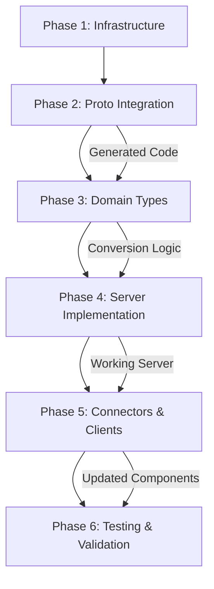

# Execution Coordination & Task Management

## Overview
This document provides the coordination framework for executing the proto interface refactor across multiple sub-agents working in parallel. It defines dependencies, handoff procedures, communication protocols, and risk management strategies.

## Execution Strategy

### Parallel Execution Model
The refactor is designed for **maximum parallelization** within each phase while maintaining strict **sequential dependencies between phases**. This approach minimizes total execution time while ensuring proper coordination.

```
Phase 1: Infrastructure (1 day)
├── Task 1A: Proto Integration (Alpha) ──┐
├── Task 1B: Build System (Beta) ────────┤
└── Task 1C: Dev Environment (Gamma) ────┤
                                         │
Phase 2: Proto Integration (1-2 days)    │
├── Task 2A: Code Generation (Alpha) ◄───┤
├── Task 2B: Server Updates (Beta) ◄─────┤
├── Task 2C: Client SDKs (Gamma) ◄───────┤
└── Task 2D: Examples (Delta) ◄──────────┘
                │
Phase 3: Domain Types (2-3 days)
├── Task 3A: Payment Methods (Alpha) ◄───┤
├── Task 3B: Payment Service (Beta) ◄────┤
├── Task 3C: Refund/Dispute (Gamma) ◄────┤
└── Task 3D: Common Types (Delta) ◄──────┘
                │
Phase 4: Server Implementation (2-3 days)
├── Task 4A: PaymentService (Alpha) ◄────┤
├── Task 4B: RefundService (Beta) ◄──────┤
├── Task 4C: DisputeService (Gamma) ◄────┤
└── Task 4D: Configuration (Delta) ◄─────┘
                │
Phase 5: Connectors & Clients (2-3 days)
├── Task 5A: Connectors (Alpha) ◄────────┤
├── Task 5B: Node.js SDK (Beta) ◄────────┤
├── Task 5C: Python SDK (Gamma) ◄────────┤
└── Task 5D: Rust SDK (Delta) ◄──────────┘
                │
Phase 6: Testing & Validation (1-2 days)
├── Task 6A: Integration Tests (Alpha) ◄─┤
├── Task 6B: Performance Tests (Beta) ◄──┤
├── Task 6C: SDK Validation (Gamma) ◄────┤
└── Task 6D: Documentation (Delta) ◄─────┘
```

## Sub-Agent Assignments

### Sub-Agent Alpha (Primary Implementation)
**Specialization**: Core implementation and complex integration tasks
- **Phase 1**: Proto file integration and validation
- **Phase 2**: Proto code generation and compilation
- **Phase 3**: Payment method type conversions (most complex)
- **Phase 4**: PaymentService handler implementation (largest service)
- **Phase 5**: Connector implementation updates (business logic critical)
- **Phase 6**: Integration testing and end-to-end validation

### Sub-Agent Beta (Infrastructure & Services)
**Specialization**: Build systems, infrastructure, and service implementations
- **Phase 1**: Build system preparation and configuration
- **Phase 2**: gRPC server code generation and initial updates
- **Phase 3**: PaymentService message conversions (largest message set)
- **Phase 4**: RefundService handler implementation
- **Phase 5**: Node.js SDK updates and testing
- **Phase 6**: Performance testing and benchmarking

### Sub-Agent Gamma (Multi-Service Integration)
**Specialization**: Cross-service integration and multi-language support
- **Phase 1**: Development environment setup and tooling
- **Phase 2**: Client SDK code generation (multi-language)
- **Phase 3**: RefundService and DisputeService conversions
- **Phase 4**: DisputeService handler implementation
- **Phase 5**: Python SDK updates and testing
- **Phase 6**: Client SDK validation and cross-platform testing

### Sub-Agent Delta (Examples & Documentation)
**Specialization**: Examples, documentation, and final validation
- **Phase 1**: Development workflow and documentation templates
- **Phase 2**: Example project updates across languages
- **Phase 3**: Common type and enum conversions
- **Phase 4**: Server configuration and error handling
- **Phase 5**: Rust client SDK and example updates
- **Phase 6**: Documentation validation and final verification

## Coordination Protocols

### Rapid Check-ins
**Frequency**: Every few hours during active work  
**Focus**: Blockers and immediate coordination needs  
**Participants**: All sub-agents  

**Quick Check Format**:
1. **Current Status** (1 min per agent)
   - What's working
   - What's blocked
   - What's needed from others

2. **Immediate Actions** (2 min total)
   - Unblock dependencies
   - Coordinate handoffs
   - Assign urgent help

### Phase Transitions
**Trigger**: When phase completion criteria are met  
**Focus**: Rapid validation and immediate handoff  
**Goal**: Minimize time between phases

**Rapid Transition Process**:
1. **Completion Check** (5 min)
   - Verify all criteria met
   - Document any pending items

2. **Immediate Handoff** (10 min)
   - Transfer working deliverables
   - Start next phase immediately
   - Address issues in parallel

### Ad-Hoc Coordination
**Communication Channels**:
- **Urgent Issues**: Immediate communication channel (Slack/Teams)
- **Code Reviews**: Async review system with 4-hour SLA
- **Documentation**: Shared documentation system (real-time editing)
- **Status Updates**: Project tracking system (updated every 4 hours)

## Dependency Management

### Critical Path Dependencies



### Intra-Phase Dependencies

#### Phase 2 Dependencies
- **Task 2B** (Server Updates) depends on **Task 2A** (Code Generation)
- **Task 2C** (Client SDKs) depends on **Task 2A** (Code Generation)
- **Task 2D** (Examples) depends on **Task 2C** (Client SDKs)

#### Phase 3 Dependencies
- All tasks can run in parallel (no intra-phase dependencies)
- All tasks depend on Phase 2 completion

#### Phase 4 Dependencies
- **Task 4D** (Configuration) depends on **Tasks 4A, 4B, 4C** completion
- Tasks 4A, 4B, 4C can run in parallel

#### Phase 5 Dependencies
- All tasks depend on Phase 4 completion
- Tasks can run in parallel

#### Phase 6 Dependencies
- **Task 6D** (Documentation) depends on **Tasks 6A, 6B, 6C** completion
- Tasks 6A, 6B, 6C can run in parallel

### Dependency Tracking
```yaml
# dependencies.yaml
phase_dependencies:
  phase_2:
    depends_on: [phase_1]
    tasks:
      task_2b: [task_2a]
      task_2c: [task_2a]
      task_2d: [task_2c]
  
  phase_3:
    depends_on: [phase_2]
    tasks: {} # No intra-phase dependencies
  
  phase_4:
    depends_on: [phase_3]
    tasks:
      task_4d: [task_4a, task_4b, task_4c]
  
  phase_5:
    depends_on: [phase_4]
    tasks: {} # No intra-phase dependencies
  
  phase_6:
    depends_on: [phase_5]
    tasks:
      task_6d: [task_6a, task_6b, task_6c]
```

## Handoff Procedures

### Deliverable Handoff Checklist

#### Code Deliverables
- [ ] Code compiles without errors
- [ ] All tests pass
- [ ] Code review completed
- [ ] Documentation updated
- [ ] Performance impact assessed
- [ ] Deliverable tagged and versioned

#### Documentation Deliverables
- [ ] Content is complete and accurate
- [ ] All examples tested
- [ ] Cross-references validated
- [ ] Format and style consistent
- [ ] Peer review completed

#### Test Results
- [ ] All tests executed
- [ ] Results documented
- [ ] Failures investigated and resolved
- [ ] Coverage requirements met
- [ ] Performance benchmarks recorded

### Handoff Communication Template
```markdown
# Handoff: [Task ID] - [Task Name]

**From**: [Sub-Agent]
**To**: [Receiving Sub-Agent(s)]
**Date**: [Date]

## Deliverables
- [ ] [Deliverable 1]: [Location/Link]
- [ ] [Deliverable 2]: [Location/Link]
- [ ] [Deliverable 3]: [Location/Link]

## Status
- **Completion**: [Percentage]
- **Quality**: [Pass/Fail with details]
- **Testing**: [Test results summary]

## Issues & Notes
- **Known Issues**: [List any known issues]
- **Workarounds**: [Any temporary workarounds]
- **Notes**: [Important notes for next phase]

## Dependencies Ready For
- [ ] [Next task 1]
- [ ] [Next task 2]

## Contact
**Available for questions until**: [Date/Time]
```

## Risk Management

### High-Risk Scenarios

#### 1. Proto Compilation Failures
**Risk**: Generated code doesn't compile  
**Probability**: Medium  
**Impact**: High (blocks entire refactor)

**Mitigation**:
- Validate proto syntax early in Phase 1
- Incremental compilation testing
- Backup plan: Rollback to previous proto version

**Escalation**: If compilation issues persist > 4 hours, escalate to coordination lead

#### 2. Performance Regression
**Risk**: New implementation significantly slower  
**Probability**: Low  
**Impact**: High (may require redesign)

**Mitigation**:
- Continuous performance monitoring
- Benchmark against baseline regularly
- Identify bottlenecks early

**Escalation**: If performance regression > 20%, immediate escalation

#### 3. Connector Integration Failures
**Risk**: Connectors don't work with new interfaces  
**Probability**: Medium  
**Impact**: High (payment processing broken)

**Mitigation**:
- Test connector integration incrementally
- Maintain backward compatibility layers
- Have rollback plan ready

**Escalation**: If >50% of connectors fail, escalate immediately

#### 4. Cross-Phase Dependencies Broken
**Risk**: Changes in one phase break previous work  
**Probability**: Medium  
**Impact**: Medium (rework required)

**Mitigation**:
- Strict interface contracts between phases
- Regular integration testing
- Version control and rollback capabilities

**Escalation**: If dependencies are broken, coordinate immediate fix

### Risk Monitoring

#### Daily Risk Assessment
Each sub-agent reports daily:
- **Red**: Critical issues blocking progress
- **Yellow**: Issues that may cause delays
- **Green**: On track with no issues

#### Weekly Risk Review
- Review all yellow and red issues
- Update mitigation strategies
- Adjust timelines if necessary
- Escalate persistent issues

### Escalation Matrix

| Issue Type | Response Time | Escalation Level |
|------------|---------------|------------------|
| Build Failures | 2 hours | Technical Lead |
| Performance Issues | 4 hours | Technical Lead |
| Connector Failures | 1 hour | Product Lead |
| Cross-Agent Blocking | 1 hour | Coordination Lead |
| Timeline Delays | 24 hours | Project Manager |

## Quality Assurance

### Code Quality Standards
- **Test Coverage**: Minimum 95% for new code
- **Code Review**: All code must be reviewed by another sub-agent
- **Documentation**: All public APIs must be documented
- **Performance**: No regression > 10%

### Review Process
1. **Self Review**: Sub-agent reviews own work
2. **Peer Review**: Another sub-agent reviews the work
3. **Integration Review**: Coordination lead reviews integration points
4. **Final Review**: All deliverables reviewed before phase sign-off

### Testing Requirements
- **Unit Tests**: All new functions must have unit tests
- **Integration Tests**: Critical paths must have integration tests
- **Performance Tests**: All major components must have benchmarks
- **End-to-End Tests**: Complete user journeys must be tested

## Communication Framework

### Regular Communications

#### Daily Updates (Required)
- **Time**: End of each work day
- **Format**: Status update in tracking system
- **Content**: Progress, blockers, next day plan

#### Weekly Summary (Required)
- **Time**: End of each week
- **Format**: Summary report
- **Content**: Week's accomplishments, upcoming week plan, risks

### Emergency Communications

#### Immediate Issues
- **Channel**: Emergency communication channel
- **Response Time**: 15 minutes
- **Escalation**: If no response in 30 minutes, escalate to coordination lead

#### Critical Blockers
- **Channel**: Coordination channel
- **Response Time**: 1 hour
- **Process**: Document issue, propose solution, get approval

### Knowledge Sharing

#### Technical Decision Log
- All technical decisions documented
- Rationale and alternatives recorded
- Impact and risks assessed

#### Lessons Learned
- Weekly capture of lessons learned
- Best practices identified and shared
- Mistakes documented for future reference

## Success Metrics

### Execution Metrics
- **Phase Completion**: On-time completion of each phase
- **Quality**: All deliverables meet acceptance criteria
- **Dependencies**: All handoffs completed successfully
- **Communication**: All coordination meetings held as scheduled

### Quality Metrics
- **Test Coverage**: >95% for all new code
- **Bug Rate**: <1% critical bugs in delivered code
- **Performance**: <5% regression in performance metrics
- **Documentation**: 100% API documentation coverage

### Coordination Metrics
- **Handoff Success**: 100% successful handoffs between phases
- **Issue Resolution**: All issues resolved within SLA
- **Communication**: 100% attendance at coordination meetings
- **Risk Management**: All high risks identified and mitigated

## Conclusion

This coordination framework ensures the proto interface refactor is executed efficiently with maximum parallelization while maintaining high quality and proper coordination. Success depends on strict adherence to the dependency management, communication protocols, and quality assurance processes defined in this document.